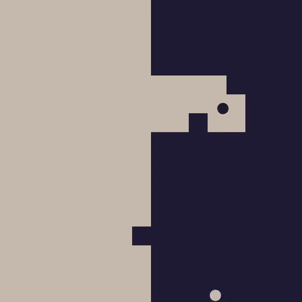

<br />
<p align="center">
   <a href="https://github.com/StarPandaBeg/DayNNight">
    
   </a>

   <h3 align="center">Day n' Night - Animation</h3>

   <p align="center">
    Simple animation of two balls</b>
   </p>
</p>

---

<div align="center">
  
</div>
<br/>

# Getting started

## Windows

Download precompiled binaries on [releases](https://github.com/StarPandaBeg/DayNNight/releases/latest) page

## Build

### Requirements

- CMake >= 3.16

To build the project please follow the instructions below:

```bash
git clone https://github.com/StarPandaBeg/DayNNight.git
cd DayNNight
cmake -B build -DCMAKE_BUILD_TYPE=Release
cmake --build build --config Release
```

# License

Distributed under the MIT License.  
See `LICENSE` for more information.

# Disclaimer

This project was created from a spontaneous idea in just a few hours. It may contain errors or inaccuracies. I would appreciate your feedback and suggestions for improvement. Thanks! 💗
